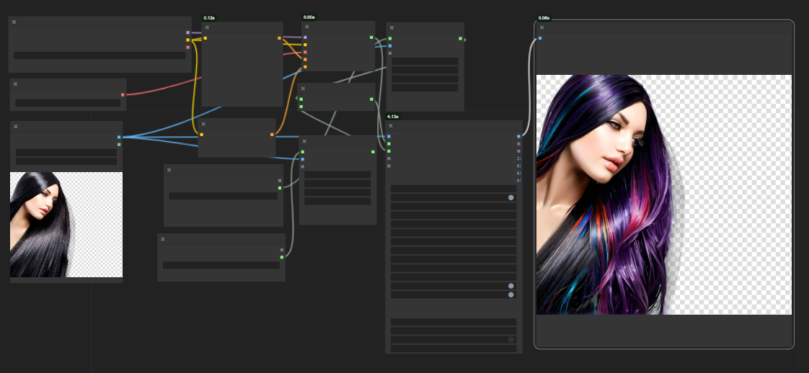
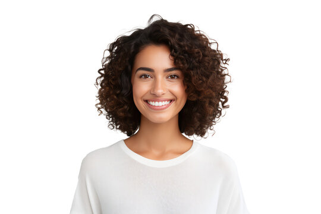
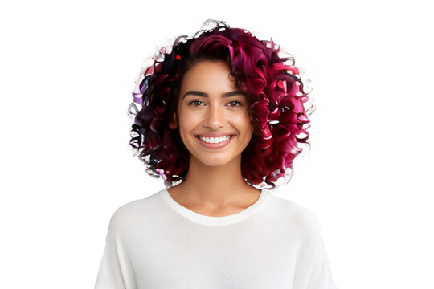
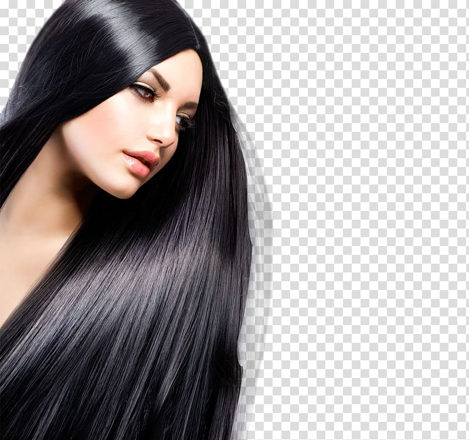
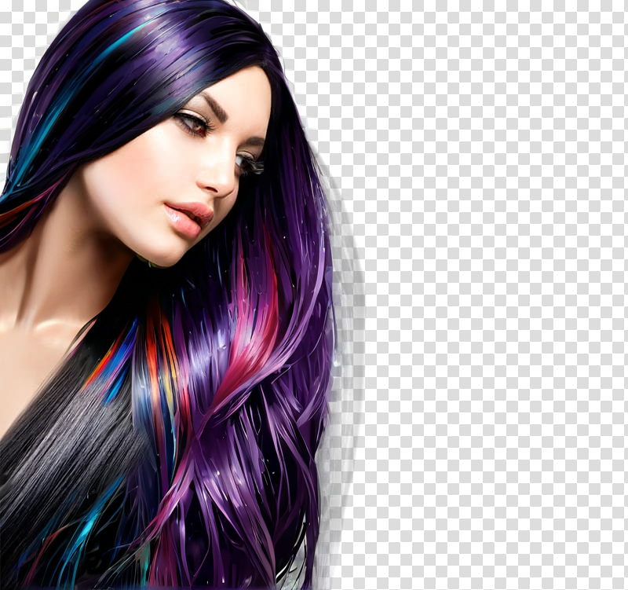

## HAIR COLOUR CHANGE
# About the workflow
This workflow uses **SEGM detector** which is used to create masks by segmenting different parts of the image, which is particularly useful for isolating regions like hair for precise color changes.

It works with **Ultralytics Detector Provider** which integrates advanced object detection models from Ultralytics, enabling the identification and segmentation of complex objects within an image to facilitate detailed and accurate edits in workflows.

# Overview

# Workflow
[Download Workflow](haihyper.json)

# How to use the workflow
* Load the workflow into the **ComfyUI** either in JSON or image format.
*  Install the appropriate custom nodes and models. Below is the models used for this workflow.
	* **Checkpoint model:** [juggernautXL_v9Rdphoto2Lightning](https://civitai.com/models/133005?modelVersionId=357609)

	* **VAE model:** sdxl_vae.safetensors
	
    * **Ultralytics Detector Provider:**
	    * Model for hair : [hair yolov8n - seg_60](https://huggingface.co/jags/yolov8_model_segmentation-set/blob/main/hair_yolov8n-seg_60.pt)
	    * Model for face : [face yolov8m - seg_60](https://huggingface.co/jags/yolov8_model_segmentation-set/blob/main/face_yolov8m-seg_60.pt)

# Generated Output

# Here is some prompt to start with
**Prompt 1:**
   

     {Silver|Rainbow,multicolored|Two-toned ,split dye, ombre|Neon,bright, vibrant colors|blonde|green|pink} hair color,high detail,shiny,high quality, uhd, 4k
    
**Prompt 2:**

    {Purple|Turquoise, teal|Gradient, balayage|Pastel, soft, subtle hues|Auburn|Blue|Red} hair color, high detail, shiny, high quality, UHD, 4K

    
